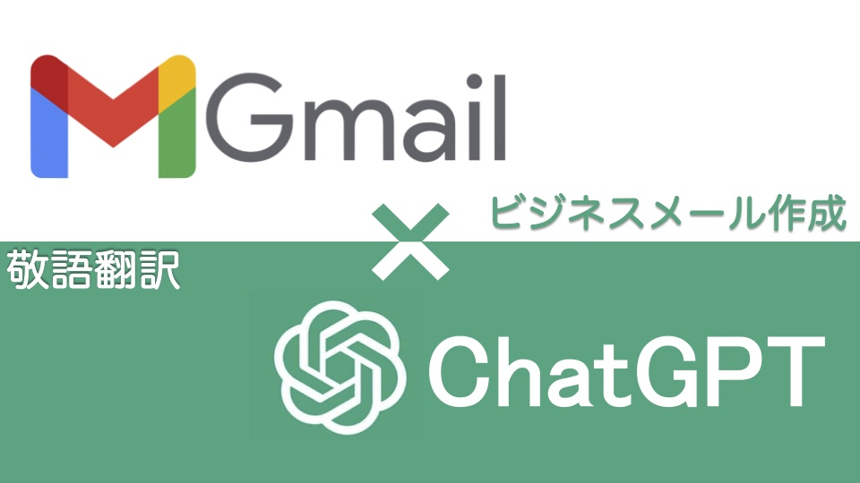
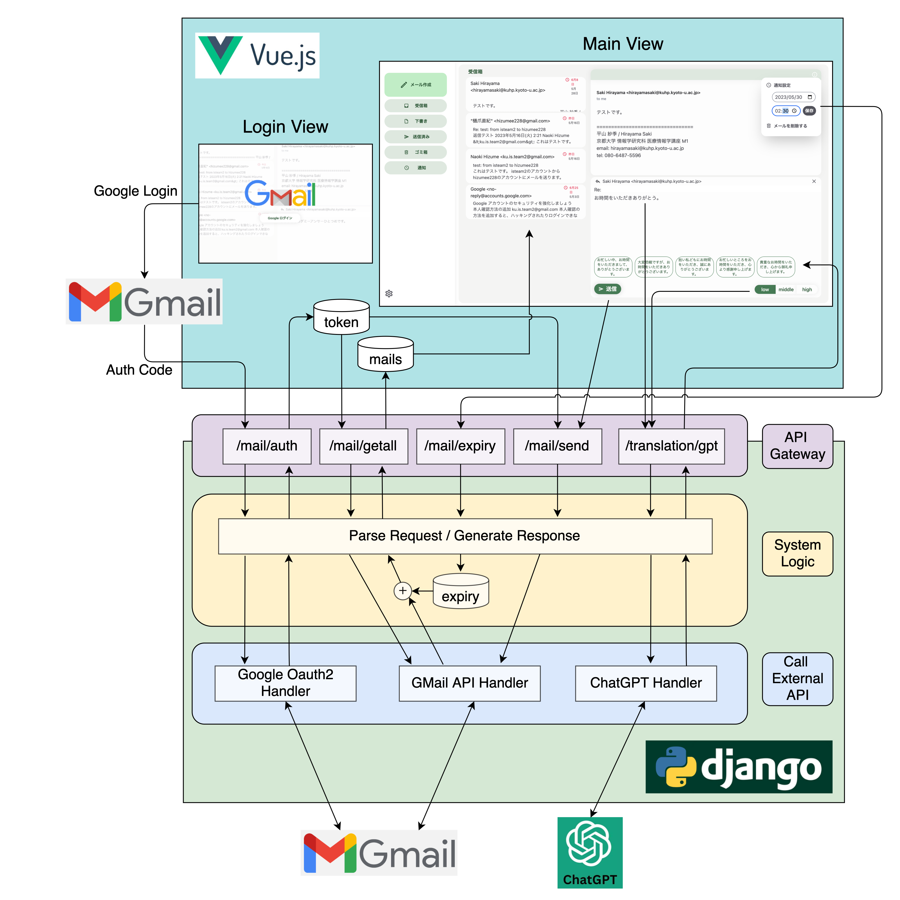

# GMail x ChatGPT ビジネスメール支援アプリ

## 概要
大学のハッカソンを行う演習の授業で５人チームで作成したWebアプリです。
GmailとChatGPTを組み合わせることで、ビジネスメールの作成や管理を支援します。

## デモ動画
実際に動いている様子のデモ動画です。
https://github.com/n-hizume/IS_team2/asset/demo.mp4

## 主な機能
- Gmailにログインし、メールを送受信できる
- メール作成時に、書いた内容をより適切な敬語に変換できる
(変換は敬語レベルを設定できる)
- 各メールに通知日時を設定でき、返信漏れを防止できる

## アーキテクチャ
システムは以下のような構成です。
フロントにはVue.js、サーバーにはDjangoを使用しています。

